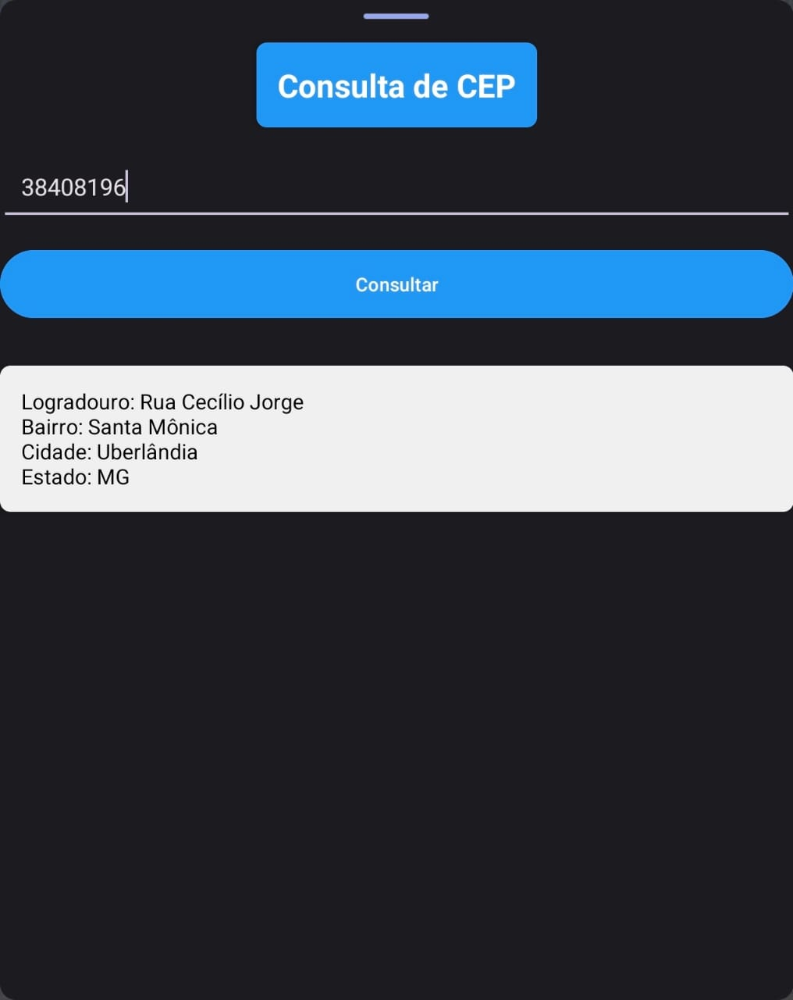

<h1 align="center">CEP Lookup</h1>

## Project
This project is an Android application that provides a user interface for looking up information based on a Brazilian postal code (CEP). Users can input a CEP and, with a single click, retrieve corresponding data which is displayed in a clean and intuitive interface.

## Layout
<div align="center">
  
</div>

## Features
- Input field for the CEP.
- Input mask to ensure proper formatting of the CEP.
- Styled consultation button in blue.
- Stylish and modern display of the consultation result.
- A stylized title with a different background.

## Technologies Used
- **Programming Language:** Kotlin
- **Development Environment:** Android Studio

## Code Author
```kotlin
fun main() {
    println("Code by Gabriela Oliveira!")
}
